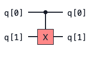
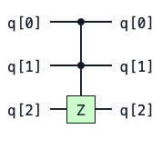
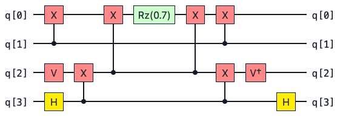
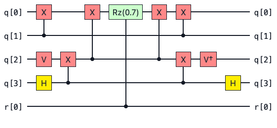

# Improved Controlled Gates in pytket

Last week brought a new pytket 1.21.0 release! See the [changelog](https://tket.quantinuum.com/api-docs/changelog.html#october-2023) for a rundown of all the new features and fixes. This blog will focus on improvements to controlled gates in pytket with the new [ConjugationBox](https://tket.quantinuum.com/api-docs/circuit.html#pytket.circuit.ConjugationBox) feature enabling some key circuit primitives to be implemented far more efficiently. There are also some improvements to how controlled gates are displayed in the circuit renderer.

## Examples of Controlled Gates

Controlled gates show up all the time in quantum computing. These gates modify a target qubit depending on the state of a control qubit (or a set of control qubits). 

Two commonly used controlled gates are the CX (or CNOT) gate and the CCZ gate.

CX                  |  CCZ
:----------------:  |:--------------------:
  |  

As you probably know, the action of the CX gate is to apply a X operation to flip the state of a target qubit if its control qubit is in the $|1\rangle$ state. If the control qubit is not in the $|1\rangle$ state then this gate acts as the identity gate.

We can understand the action of the CX gate on a two qubit state by looking at its truth table. The CX gate has the following action on the two qubit computational basis states.

| Input State| Output State|
| -----------| ------------|
| 00         | 00          |
| 01         | 01          |
| 10         | 11          |
| 11         | 10          |

The action of the CCZ gate shown above is to add a phase of $-1$ if both control qubits are in the $|1\rangle$ state. So if the combined state of both controls is $|11\rangle$, then a Pauli Z operation is applied to the target qubit.

## Some Terminology

**Control state:** The state that the control qubits must be in for the operation to be applied to the target. Typically we assume that the control state is "all $|1\rangle$" unless specified otherwise. However this need not be the case. In general the control state can be any string of $|0\rangle$ and $|1\rangle$.

 **Base gate:** The operation that is applied to the target qubit(s) when the control qubits are in the control state. So for the CCZ gate above the control state is $|11\rangle$ and the base gate is the Pauli $Z$ operation.

 **Conjugation pattern:** We say that a unitary operation $U_c$ fits the conjugation pattern if it can be expressed as follows

$$
\begin{equation}
U_{c} = V \, A \, V^\dagger \, .
\end{equation}
$$

This compute ($V$), action ($A$), uncompute ($V^\dagger$) pattern occurs frequently in quantum computing. This pattern is captured by the new `ConjugationBox` construct in pytket.

In pytket `1.21.0` we can find much smarter decompositions for controlled gates where the base gate fits the conjugation pattern $V \, A \, V^\dagger$. The trick here is that to construct a controlled `ConjugationBox` you only have to control on the central $A$ operation rather than every single gate in the circuit.

 ## An Example Using Pauli Gadgets

 Shown below is an example of a Pauli gadget circuit. This is a great example of a common circuit primitive that fits the conjugation pattern $V \, A \, V^\dagger$.
 

 {align=center}

This circuit implements a unitary of the form $ U = e^{-i \frac{\pi}{2} \theta P}$ where $\theta = 0.7$ and $P$ is a tensor product of Pauli operators.

$$
\begin{equation}
P = Z \otimes Z \otimes Y \otimes X 
\end{equation}
$$

This type of operation shows up very naturally in quantum chemistry when trotterising Hamiltonians. Readers familiar with the quantum phase estimation algorithm (QPE) may know that QPE requires many controlled unitary operations to implement. Often the unitary will be a time evolved Hamiltonian represented by a Pauli gadget. So being able to implement these controlled unitaries efficiently could reduce the complexity of the circuit needed for QPE.

In addition to having the form of a conjugation pattern, Pauli gadget circuits have some cool algebraic properties that can be exploited for circuit optimisation [[1](#references)].

Now if we squint at the circuit diagram above, we see that it's almost symmetric around the central Rz rotation. In fact, the left hand side of the Rz gate is exactly the dagger of the right hand side. If we identify the central Rz gate as the action $A$ then it is clear that the subcircuits to the left and right hand side of $A$ can be identified with $ V$ and $V^\dagger$.

Since all Pauli gadget circuits are in the form of a `ConjugationBox`, it is sufficient to simply control on the central Rz operation like so.

  {align=center}

Let's now construct a circuit for this Pauli gadget using pytket's `PauliExpBox` construction. More information on `PauliExpBox` can be found in the [user manual](https://tket.quantinuum.com/user-manual/manual_circuit.html#pauli-exponential-boxes).

```python
from pytket.pauli import Pauli
from pytket.circuit import PauliExpBox

zzyx_box = PauliExpBox([Pauli.Z, Pauli.Z, Pauli.Y, Pauli.X], 0.7)
```


Now we can construct a controlled `PauliExpBox` using `QControlBox`. A `PauliExpBox` is now handled internally as a `ConjugationBox` so the controlled operation can be done much more efficiently.

```python
from pytket.circuit import QControlBox

# A controlled PauliExpBox with a single control (n=1)
controlled_zzyx = QControlBox(zzyx_box, 1)
```

Now that we have our constructed our controlled unitary, we can do a comparison between pytket versions to highlight the benefit on the `ConjugationBox`.

Let's run the code below with pytket 1.20.1 and pytket 1.21 and compare the number of gates required to implement this controlled Pauli gadget. We will decompose the boxes and compile the circuit down to one and two qubit gates with the `SynthesiseTK` pass to ensure a fair comparison.

```python
from pytket import Circuit
from pytket.passes import DecomposeBoxes, SynthesiseTK

test_circ = Circuit(5)
test_circ.add_gate(controlled_zzyx, [0, 1, 2, 3, 4])

DecomposeBoxes().apply(test_circ)
SynthesiseTK().apply(test_circ)

print("Total gate count:", test_circ.n_gates)
print("2 qubit gates:", test_circ.n_2qb_gates())
```

**pytket 1.20.1**
```
Total gate count: 103
2 qubit gates: 44
```

**pytket 1.21.0**
```
Total gate count: 22
2 qubit gates: 8
```

Now that's a big difference! We see pytket 1.21.0 is able to use the underlying `ConjuagtionBox` structure of the Pauli gadget to find a far more efficient implementation.

The improvement in the number of two qubit entangling gates is particularly nice when we think about running circuits on real quantum hardware. Entangling gates are in general much more noisy than single qubit gates so getting rid of them where possible can be great for boosting the fidelity of our computation.  

The reason for the reduction is that pytket 1.21.0 can simply control on the single Rz in the Pauli gadget. Previously if we wanted to construct a controlled Pauli gadget, pytket would naively construct a controlled version of every single gate in the base Pauli gadget circuit. In version 1.20.1, pytket naively converts all of the CX gates to CCX gates and then has to compile those down to one and two qubit gates with a significant overhead.

```{note}
We have shown how we can compile controlled Pauli gadget circuits by making use of the conjugation pattern. This is now logic internal to pytket. 

You can also define your own [ConjugationBox](https://tket.quantinuum.com/api-docs/circuit.html#pytket.circuit.ConjugationBox) by providing a `compute`, `action` and `uncompute` operation. Can you think of other cases where this construct would be useful?
```

 ## Some Mathematical Details

 So why does this work?

 Here we will show that if we have a controlled gate whose base gates fits the `ConjugationBox` pattern then it is only necessary to control on the central $A$ operation.

 Recall the the form of the conjugation pattern

$$
\begin{equation}
U_c = V \, A \, V^\dagger \, .
\end{equation}
$$

To avoid ambiguity in what follows we will denote a controlled-$P$ operation as $C[P]$ where $P$ is some unitary operator.

Now we want to show that

$$
\begin{equation}
C[U_c] = C[V \, A \, V^\dagger] = (I \otimes V) C[A] (I \otimes V^\dagger)\, .
\end{equation}
$$

A controlled-$P$ operation can be expanded out as follows

$$
\begin{equation}
C[P]= |0\rangle\langle 0| \otimes I + |1\rangle\langle1| \otimes P \, .
\end{equation}
$$

To prove our result let's take the right hand side of our target equation and expand the $C[A]$ term.

$$
\begin{align}
(I \otimes V) C[A] (I \otimes V^\dagger) &= (I \otimes V ) \,( |0\rangle\langle 0| \otimes I + |1\rangle\langle1| \otimes A )\, (I \otimes V^\dagger) \\
&= |0\rangle\langle 0| \otimes \cancelto{I}{V \, I \, V^\dagger} + |1\rangle\langle1| \otimes V \, A \, V^\dagger \\
\implies (I \otimes V) C[A] (I \otimes V^\dagger) &= |0\rangle\langle 0| \otimes I + |1\rangle\langle1| \otimes U_c = C[U_c]
\end{align}
$$


## References  

1. A. Cowtan, S. Dilkes, R. Duncan, W. Simmons, and
S. Sivarajah, “Phase gadget synthesis for shallow circuits,” in 16th International Conference on Quantum
Physics and Logic 2019. Open Publishing Association,
2019, pp. 213–228