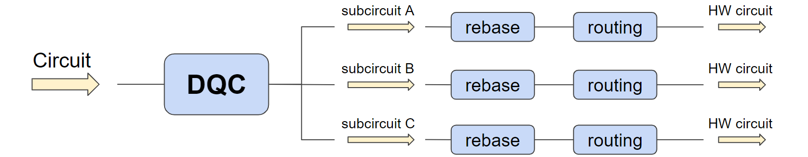
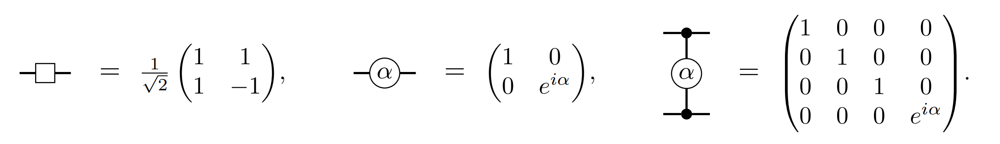
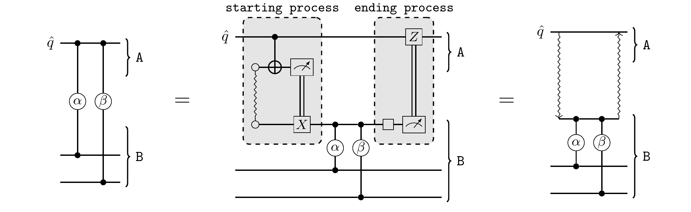
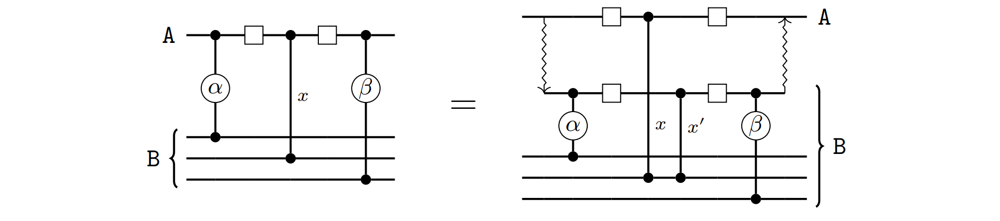
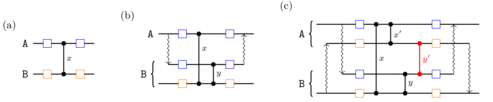
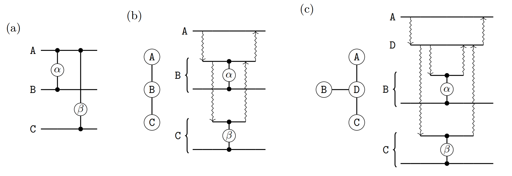
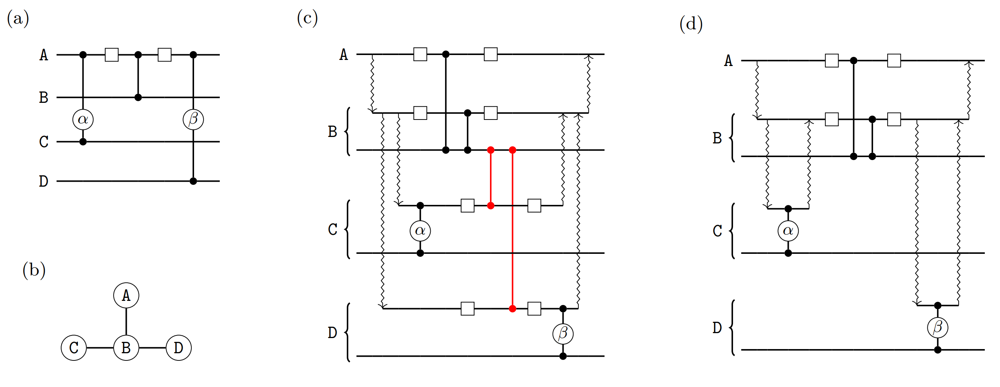

# Optimisation of Distributed Quantum Circuits

As quantum computers scale up, their basic components grow farther apart, increasing the challenge of driving accurate interactions between them. Distributed quantum computing proposes a strategy that focuses on separation of concerns: first, engineer a quantum computer that performs reliably on the limited number of qubit it can manage and, then, produce multiple copies of it and connect them together to create larger devices. This strategy establishes two abstract levels of qubit interactions: within a single quantum computing module and between different modules. An efficient quantum circuit would use as few of the latter inter-module qubit interactions as possible, since those will be the main bottleneck of the computation.

From a user's perspective, however, it is desirable to think of an architecture with $k$ quantum modules of $n$ qubits each as a large monolithic quantum computer of $kn$ qubits. It is then the task of the quantum compiler to convert the user's circuit into an equivalent one comprised of $k$ different subcircuits -- each of at most $n$ qubits -- orchestrated together in such a way that the quantum interactions between modules are minimised. This blogpost discusses approaches for the automatisation of such a task, which resulted from a research project in collaboration between Quantinuum and Mio Murao's group from the University of Tokyo. For a more detailed discussion, please refer to the two papers we wrote on the subject [[1](#references)] and [[2](#references)]. The code implementing these approaches is available as a [pytket extension](https://github.com/CQCL/pytket-dqc). A Jupyter notebook showcasing its basic usage can be found [here](https://github.com/CQCL/pytket-dqc/blob/main/examples/basic_usage.ipynb).

In our framework, we assume that the bottleneck of the computation is at the interaction between modules, and that the cost of computation within a module is comparatively "free". Consequently, we do not attempt to optimise the layout of the subcircuits. Of course, once the circuit is distributed efficiently, the next stage of optimisation would be to apply standard optimisation passes on each of the subcircuits to further optimise the internal execution in each module. Such passes are available in `pytket` (see the [manual](https://tket.quantinuum.com/user-manual/manual_compiler.html)), including rebasing the circuit to the hardware's native gateset, qubit routing [[5](#references)] and overall circuit optimisation.

We only allow quantum interactions between different modules in the form of shared Bell states. In particular, we make use of the following Bell state

$$\ket{\Phi^+} = \frac{1}{\sqrt{2}} \ket{00} + \frac{1}{\sqrt{2}} \ket{11}.$$

Protocols such as quantum teleportation use these states as a resource to communicate quantum information between spatially separated parties. The metric we wish to minimise in our optimisation task is the number of Bell states required to execute the resulting distributed circuit. Our framework is agnostic in regards to how these Bell states are generated: they may be generated by an external device and shared between the quantum computing modules, it may be that each quantum module generates Bell states internally and shuttles one of the qubits to another module, or it may even be that Bell states are not actually realised physically, but instead simulated via sampling and classical postprocessing using circuit-knitting techniques [[4](#references)].

The problem of optimising a distributed quantum circuit can be split into two subproblems. The first one is *qubit allocation*, where we decide which quantum computing module holds each qubit. Notice that, once qubits are allocated, some of the gates in the circuit may act on qubits located in different modules -- we refer to these as *non-local gates*. The second subproblem requires us to decide how each of these non-local gates will be implemented via the consumption of Bell states. A simple solution to the qubit allocation problem is to partition the circuit in such a way that the number of non-local gates is minimised; this can be achieved by applying standard graph partitioning algorithms to the connectivity graph of the circuit. We can obtain better qubit allocations if we take into account subtleties on how the non-local gates may be implemented, as discussed in our paper [[2](#references)] and other works from the literature [[3](#references)]. For the sake of simplicity, in this blogpost we assume qubit allocation is solved via the simple graph partitioning approach, so that we can move on to the more intriguing aspects of non-local gate implementation.

The circuits that we will discuss here will be comprised of gates in the following universal gateset:

We will refer to the different quantum computing modules using upper case letters $A, B, ...$ and draw circuit diagrams with curly brackets to indicate that the selected qubits are all allocated to the specified module.

## Multi-gate teleportation and embedding

We expect most readers will be familiar with the standard quantum teleportation protocol, where an arbitrary qubit is sent from one party to another by consuming a previously shared Bell state, along with some extra classical communication. Similarly, we can devise a gate teleportation protocol, where a single Bell state is consumed to apply a gate to a remote qubit, without changing the party that originally held the qubit. Interestingly, we can push gate teleportation further and use a single Bell state to apply multiple gates acting on the same remote qubit. For this to be possible, each of the gates must share certain property formalised in [[1](#references)]. In practical terms, multi-gate teleportation is possible whenever each of the gates being teleported are controlled gates, with the remote qubit acting as their control. The circuit diagram below shows how this can be achieved.

The wavy line within the gray box labelled "starting process" represents a Bell state shared between modules $A$ and $B$. All of the quantum gates in the second circuit are local, i.e. they act on qubits located in the same module. The rightmost diagram depicts our shorthand notation for the "starting process" and "ending process" as wavy arrows. We refer to the collection of non-local gates implemented by a single multi-gate teleportation protocol as a *distributable packet*, or packet for short.

On its simplest form, the multi-gate teleportation protocol requires that there are no additional gates between the starting process and ending process. A straightforward generalisation of this is to allow single-qubit $Rz$ rotations acting on the remote qubit $\hat{q}$, since these commute with the controlled gates and can safely be applied before or after the multi-gate teleportation protocol. More interestingly, if there are $CZ$ gates sandwiched between Hadamard gates, a multi-gate teleportation protocol can still be realised, at the cost of adding extra gates as shown in the diagram below.

We refer to the additional $CZ$ gate labelled $x'$ above as a *correction gate*. Notice that the correction gate $x'$ acts on qubits that live in the same module $B$, so the gate is local and it can readily be implemented in $B$. We then say that the gate $x$ has been *embedded* within the multi-gate teleportation protocol. Notice that $x$ itself is a non-local gate and a separate gate teleportation is required to implement it.

We can now sketch the core of our non-local gate implementation approach. First, we scan the circuit and detect all distributable packets -- that is, groups of contiguous non-local gates acting on the same qubit. We then check which of these packets are separated by a sequence of embeddable gates and, when possible, merge them together into a single distributable packet -- again, implementable consuming just one Bell state. At the end of this process, each non-local gate in the circuit will be present in two packets: one for each of its two qubits. Realising either of the two packets via the multi-gate teleportation protocol would result in the non-local gate being implemented and, hence, the problem becomes a matter of selecting a subset of packets that, in conjunction, contain all of the non-local gates in the circuit. This can be represented and solved as a vertex covering problem on a graph where the vertices are packets and the edges are non-local gates. However, there is a caveat which can make our solution invalid, as discussed in the next section.

### Embedding conflicts

Assume we wish to realise two different distributable packets, each with a separate instance of the multi-gate teleportation protocol. All of the gates in one packet have their remote qubit in module $A$, and the other packet has its remote qubit in module $B$. Furthermore, assume both of these packets contain some common embedded gate $x$, as shown in figure (a) below.

In figure (b) we show how distributing the packet with remote qubit in $A$ would cause a correction gate $y$ to appear, due to the embedding of $x$. Figure (c) shows the resulting equivalent circuit if we attempt to also distribute the other packet. The correction gate $y'$ necessary to embed $y$ turns out to be a non-local gate! This defeats the purpose of embedding, since the Bell state we saved from joining packets via embedding must now be spent on implementing a new non-local gate $y'$.

To avoid this situation, we can scan the packets selected by the vertex cover approach discussed above and detect when an embedding conflict would appear. For each conflict detected we must choose which of the two distributable packets will embed the offending gate. Since no two packets can embed the same gate, the other distributable packet must be split back into two separate packets, each to be realised by a different multi-gate teleportation protocol. The choice of which packets to split to solve all embedding conflicts is not immediately obvious but, fortunately, we can identify them automatically by solving another vertex covering problem on a slightly different graph, where now the edges represent conflicts between packets. The details can be found in [[1](#references)]. Once this process is finished, we have reached a valid implementation of the non-local gates in the circuit, making use of the multi-gate teleportation protocol and embedding to reduce the number of Bell states that are required.

## Heterogeneous networks of modules

So far we have not given any thought to the topology of the network connecting the quantum computing modules. We can expect that the spatial layout of the modules may influence the connectivity between them, since creating Bell states between spatially adjacent modules might be easier.

In this project, we chose not to make any assumptions on the inter-connectivity of the different quantum computing modules and, instead, ask the user to model their network topology as a graph. Given such a graph -- where vertices are modules and edges are direct connections between them -- a new optimisation opportunity arises. For instance, in figure (b) below, the path between module $A$ and $C$ is of length two and, consequently, in order to implement the $\beta$ gate we will need to consume two Bell states; fortunately, in doing so, the intermediate connection between $A$ and $B$ can be used to implement the $\alpha$ gate without any extra cost!

Figure (c) above shows another case where we can save some Bell states by "reusing" common connections in the communication paths: module $A$ needs to share some entanglement with both $B$ and with $C$; since they are both at distance two, we would naively need four Bell states, but we can save one by reusing the entanglement between $A$ and $D$ for both paths. The task of finding efficient paths from one vertex of a graph (e.g. module $A$) to a collection of other vertices (e.g. modules $B$ and $C$) using common edges as much as possible, so that the total number of edges (Bell states consumed) is minimised, is known in computer science as the Steiner tree problem. Being a well-studied problem, we can apply standard algorithms to find efficient solutions so that, so far, our workflow looks as follows:

1. Decide qubit allocation, either via simple graph partitioning or some more subtle approach such as in [[2](#references)] or [[3](#references)].
2. Scan the circuit for distributable packets and embedding opportunities; using vertex covering indentify an efficient subset of these packets and embeddings to be realised, so that all non-local gates are implemented.
3. Some of the distributable packets the previous step demands us to realise may require entanglement between non-adjacent modules; we look for distributable packets sharing a common remote qubit with different modules and find Steiner trees that minimise the number of Bell states needed to simultaneously realise the corresponding multi-gate teleportations.

Unfortunately, we encounter a new caveat. As explained in the following section, the presence of embedded gates can sometimes hinder the use of Steiner trees. This means that we need a fourth step in our workflow, which takes all of the knowledge about optimisation opportunities gathered so far and makes the final decision on how the non-local gates are implemented.

### Solving incongruencies between Steiner trees and embedding

The root of the issue between Steiner trees and embedding is the same of that discussed in the section on "Embedding conflicts": if we are not careful, the necessary correction gates introduced by embedding may be non-local, thus requiring extra Bell states and nullifying the savings we achieved with Steiner trees. An example of a simple circuit where this can happen is depicted in the figure below, where every qubit in circuit (a) is in a different module and the gates $\alpha$ and $\beta$ are in the same distributable packet, with the Hadamard gates and $CZ$ gate being embedded.

Figure (b) shows the connectivity between the modules and, according to the Steiner trees strategy previously discussed, we would like to "reuse" the entanglement between modules $A$ and $B$ to realise both the non-local gate between $A$ and $C$ and that between $A$ and $D$. However, if we simply realise all connections at the beginning of the protocol, all of the four modules will be simultaneously connected, requiring some extra non-local correction gates depicted in red in figure (c). Alternatively, as shown in (d), we can simply delay the starting process between $B$ and $D$ until it is strictly necessary and, similarly, close the connection between $B$ and $C$ before the embedded gate. In this way, we reach the best case scenario: we are reusing the entanglement between $A$ and $B$ and we are implementing both $\alpha$ and $\beta$ in the same distributable packet.

It is not always possible to reach this best case scenario, but we can come up with a strategy that will always output a valid distributed circuit and, when possible, land on ideal solutions such as that of figure (c) above. The idea that enables this is quite simple: always apply starting and ending processes as late as possible. This leads to the fourth step of our workflow:

4. Scan the original circuit from beginning to end and produce the distributed circuit as you go, following the choice of distributable packets from step 2. While doing so, create the entanglement between non-adjacent modules as suggested by the Steiner trees of step 3, but delay the application of each starting process until immediately before the first non-local gate that requires it -- open connections as late as possible -- and, similarly, apply each ending process immediately before any embeddable gate that would otherwise require non-local correction gates -- close connections as late as possible.

This process can be automated and the result of the complete workflow is a compilation pass that, given any user-defined circuit and a heterogenous network of modular quantum computers, outputs an equivalent distributed circuit. The number of Bell states consumed by such a distributed circuit is minimised using multi-gate teleportation, embedding and Steiner trees.

## Conclusions

This blogpost has summarised the outcomes of a project with the University of Tokyo. The technical details can be found in [[1](#references)] and [[2](#references)], and the code implementing our approach is available as a [pytket extension](https://github.com/CQCL/pytket-dqc), hosted on an open sourced repository. What we have described in this blogpost corresponds to the `EmbedSteiner` workflow in our paper [[2](#references)]. During the project we considered alternative workflows: on one hand, there is a further refinement of `EmbedSteiner`, where a fifth step looks for opportunities to implement non-local gates as *detached gates*, further reducing the number of Bell states consumed. We also provide an alternative workflow where, instead of focusing on embedding and then trying to use Steiner trees to improve the solution, we proceed the other way around, creating first an initial solution exploiting Steiner trees and then refining it with the help of embedding. Both approaches perform similarly, with the approach discussed in this blogpost doing slightly better for the circuits we benchmarked against in our paper.

In our work we have focused on the use of multi-gate teleportation exclusively, but we believe there is room for further gains if we combine multi-gate teleportation with standard qubit teleportation. Such an idea -- in isolation from embedding and Steiner trees -- has been explored in [[3](#references)]. A limitation to our approaches is that our workflow does not consider a bound to the number of ancillary qubits used for communication; in appendix C of [[2](#references)] we discuss that this can be enforced as a final refinement pass to any of our workflows. An alternative approach that does preemptively bound the number of ancillary qubits, but does not make use of embedding or Steiner trees, appears in [[3](#references)]. Finally, we believe an exciting avenue of further work would be to extend our methods to $n$-qubit gates where $n > 2$ and to change the metric that we use to assess the efficiency of the distribution: instead of counting the number of Bell states consumed, estimate final error rate and overall computation time.

It is a standard strategy in engineering to turn to distributed modular architectures when scaling up single systems becomes more challenging than creating networks of them. The technology might not be ready just yet but, when distributed quantum computing arrives, we will need compilers to be ready to make the best use of it.

## References

1. J.Y. Wu, K. Matsui, T. Forrer, A. Soeda, P. Andres-Martinez, D. Mills, L. Henaut and M. Murao. "[Entanglement-efficient bipartite-distributed quantum computing](https://arxiv.org/abs/2212.12688)". Quantum 7 (2023): 1196.
2. P. Andres-Martinez, T. Forrer, D. Mills, J.Y. Wu, L. Henaut, K. Yamamoto, M. Murao and R. Duncan. "[Distributing circuits over heterogeneous, modular quantum computing network architectures](https://arxiv.org/abs/2305.14148)", in review.
3. R.G. Sundaram, H. Gupta and C.R. Ramakrishnan. "[Distribution of quantum circuits over general quantum networks](https://arxiv.org/abs/2206.06437)". 2022 IEEE International Conference on Quantum Computing and Engineering (QCE).
4. C. Piveteau and D. Sutter. "[Circuit knitting with classical communication](https://arxiv.org/abs/2205.00016)". IEEE Transactions on Information Theory (2023).
5. A. Cowtan, S. Dilkes, R. Duncan, A. Krajenbrink, W. Simmons and S. Sivarajah. "[On the qubit routing problem](https://arxiv.org/abs/1902.08091)". In 14th Conference on the Theory of Quantum Computation, Communication and Cryptography (TQC 2019).