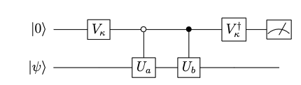

# September Release Notes (pytket)

The September release brings typing improvements, custom control states in `QControlBox`, equality checking for pytket boxes and more.

## pytket 1.19.0

### New Features ([Changelog](https://tket.quantinuum.com/api-docs/changelog.html))
* [Typing for compiled modules](#typing-improvements-for-compiled-pytket-modules)
* [Custom control states in ``QControlBox``](#custom-control-states-in-qcontrolbox)
* [New ``ConjugationBox`` construction](#new-conjugationbox-construction)
* [Equality checking implemented for all boxes](#equality-checking-for-all-box-types).
* [Every pytket `Op` now has an ``is_clifford`` method](#every-pytket-op-now-has-an-is-clifford-method)
* [``QubitPauliTensor`` class is now available in ``pytket.pauli``](#qubitpaulitensor-class)

### Fixes (1.19.0)
* It is now possible to create an empty ``BackendResult`` object.
* Performance fix for symbolic angle squashing.

### Update - Fixes (1.19.1)
* Fix for a regression in ``RebaseCustom``. The ``RebaseCustom`` pass would fail to convert circuits containing TK2 gates due to a change released in a previous version. This is now fixed in 1.19.1.
* Fix to `Circuit.symbol_substitution` for circuits containing box types that don't support symbol substitution. Boxes which don't support symbol substitution include the [unitary synthesis boxes](https://cqcl.github.io/pytket/manual/manual_circuit.html#boxes-for-unitary-synthesis) and [assertion boxes](https://cqcl.github.io/pytket/manual/manual_assertion.html).


### Typing improvements for compiled pytket modules

In previous versions of pytket, type information was not available for any of the compiled modules, which represent a large part of the library.

For this reason, when using type checkers such as mypy or pyright, it was necessary to use `# type: ignore` statements like the following.

```python
from pytket.circuit import CircBox # type: ignore

my_circbox = CircBox(...)
```

This also meant that certain type hints and auto complete feature were not available to developers when using compiled modules such as `pytket.circuit` and `pytket.passes`.

pytket now includes type information for all compiled modules via automatically generated type stub files. `# type: ignore` statements are no longer needed. This means that developers can use type checkers more freely and take advantage of type hints and autocomplete when working with pytket.

Note that using `# type: ignore` does not suppress type information if it is available. This means that type checking runs that were previously passing may now fail if the usage of objects from compiled modules is deemed improper by the type checker.

```{warning} 
In order to use some of the [pytket extension modules](https://cqcl.github.io/pytket-extensions/api/index.html) with pytket 1.19.0 or newer, you will need to use a version of the extension package that was released in September 2023 or later. This is due to the typing changes in the pytket 1.19.0 release.
```

 ### Custom control states in ``QControlBox``

 In pytket `QControlBox` provides an interface for users to define controlled unitary operations.


 Given a pytket `Op` we can define a ``QControlBox`` as follows

 ```python
 from pytket.circuit import OpType, Op, QControlBox

s_gate_op = Op.create(OpType.S)
cccs = QControlBox(s_gate_op, 3) # define a CCCS gate
 ```
Here we have defined $S$ gate controlled on 3 qubits. This means that an S will be applied when all 3 control qubits are in the $|1\rangle$ state.


 However prior to the 1.19 release a `QControlBox` could only be defined using the "all $|1\rangle$" control state. 

 This has now changed and `QControlBox` now accepts a `control_state` argument. If no `control_state` argument is provided then the default "all $|1\rangle$" state is used. Lets define a controlled-$S$ gate with a control state of $|010\rangle$.

 ```python
from pytket.circuit import OpType, Op, QControlBox

s_gate_op = Op.create(OpType.S)
custom_cccs = QControlBox(s_gate_op, 3, control_state=[0, 1, 0]) 
# Equivalent to the above (using an integer control_state)
# custom_cccs = QControlBox(op, 3, control_state=2)
 ```

 Now the $S$ gate will be applied to the target when the three control qubits are in the $|010\rangle$ state.

These sorts of gates appear frequently in quantum algorithms. Here is a simple example of an LCU (Linear combination of unitaries) circuit.



This circuit can be used to calculate the expectation value of the sum of $U_a$ and $U_b$. Here the empty circle in the second control gates denotes a "0-controlled" gate.

$$
\begin{equation}
 \langle U_a + U_b \rangle =  \langle  \psi| U_{a} + U_{b} | \psi \rangle
\end{equation}
$$

Suppose we create a `CircBox` for the $U_a$ operation. We can then construct a `QControlBox` for the 0-controlled $U_a$ as follows

```python
from pytket.circuit import CircBox, QControlBox

ub_box = CircBox(...) 

zero_controlled_ub = QControlBox(ub_box, 1, control_state=[0])
```

### Every pytket `Op` now has an `is_clifford` method

Clifford circuits are an important class of quantum circuits known to exhibit efficient classical simulation.

A Clifford gate is an element of the Clifford group which can be generated by the $\{H, S, CX\}$ operations. Such operations map Pauli operations $P$ to other Pauli operations $P'$  when conjugated as follows

$$
\begin{equation}
P' = C \, P \, C^\dagger \, .
\end{equation}
$$

For instance a Pauli $X$ can be transformed to a Pauli $Z$ by conjugating with a Hadamard Gate.

$$
\begin{equation}
X = H \, Z \, H^\dagger = H \, Z \, H \, .
\end{equation}
$$

Given a pytket `Op` we could check whether it was a Clifford type operation with the `Op.is_clifford_type` method. 

```python
from pytket.circuit import Op, OpType

s_gate_op = Op.create(OpType.S)
s_gate_op.is_clifford_type()
```
This returns `True`, the $S$ gate is a well known Clifford gate. 

However `Op.is_clifford_type` is limited as it only checks whether the underlying `OpType` is Clifford. This check would not be able to handle the case of parameterised gates that have Clifford angles.

```python
rz_clifford_op = Op.create(OpType.Rz, [1])
rz_clifford_op.is_clifford_type()
```
Here we have defined the Rz op with the $1$ rotation parameter (equivalent to 1 half turn). 
The `is_clifford_type` method will return `False` here as the Rz gate is not in general a Clifford gate.

However in pytket 1.19 we can now use the more general `Op.is_clifford()` method. 

```python
rz_clifford_op.is_clifford()
```
This method will now correctly identify the Rz gate as a Clifford by checking whether the parameter is a Clifford angle.


### ``QubitPauliTensor`` class

The ``QubitPauliTensor`` class is now exposed to pytket. A ``QubitPauliTensor`` is defined using a `QubitPauliString` paired with a complex coefficient. 

This allows phase to be tracked when using the `UnitaryTableau`.

### Equality checking for all box types

A pytket box represents a higher level subroutine that can be added to a quantum circuit. For more on the different types of box available in pytket, read the [user manual section](https://tket.quantinuum.com/user-manual/manual_circuit.html#boxes).

After the pytket 1.19 release, every box type now allows for equivalence checking. 

```python
from pytket.circuit import Circuit, CircBox

ghz_circ = Circuit(3, name="GHZ").H(0).CX(0, 1).CX(0, 2)

# Construct two equivalent CircBox objects
box1 = CircBox(ghz_circ)
box2 = CircBox(ghz_circ)

box1 == box2
```
This equality check will now return `True` in pytket 1.19. In older versions of pytket, the equality check would return `False`.

Being able to test for equivalence is useful for testing purposes. We can validate the ``CircBox`` without decomposing it or having to defer to the underlying circuit with the `CircBox.get_circuit()` method.


### New ``ConjugationBox`` construction

 Another enhancement related to controlled gates is the new ``ConjugationBox`` feature. This allows us to find efficient decompositions for controlled gates when our base gate $U_{\text{conj}}$ is of the form

$$
\begin{equation}
U_\text{conj} = C \, A \, C^\dagger
\end{equation}
$$
Where $U_{\text{conj}},\, A$ and $C$ are unitary operations.

 This compute ($C$), action ($A$), uncompute ($C^\dagger$) pattern occurs frequently in various applications of quantum computing. It can be shown that to construct a controlled $U_{\text{conj}}$ operation it is only necessary to control on the central $A$ operation. 

 Enhancements to this feature will be added in a subsequent release to handle `ConjugationBox` objects inside `QControlBox`, enabling more efficient compilation. 